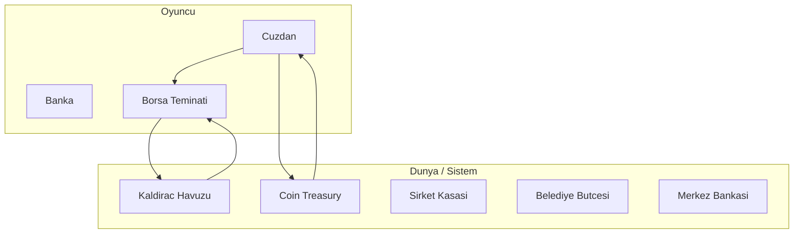
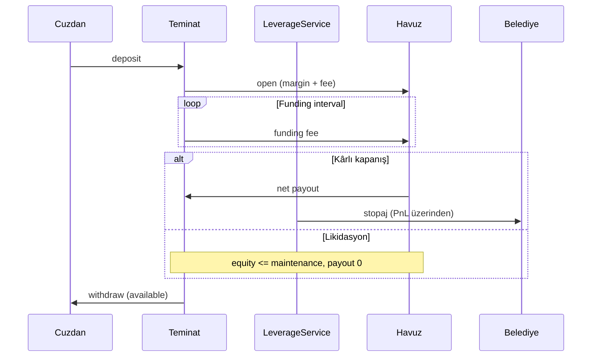

# McEconomy — Ekonomi Sistemi Dokümantasyonu

Fabric Minecraft modu: fiat para (MC/$), market, borsa, kaldıraç, banka, şirketler ve makro döngü. Bu belge geliştiriciler, sunucu OP'leri ve ileri oyuncular için para katmanlarını ve işlem bazlı para akışlarını açıklar.

Oyuncu rehberi: oyun içi panel **Rehber** sekmesi (`docs.js`). Teknik detay burada.

---

## 1. Genel bakış


| Kavram             | Açıklama                                                                        |
| ------------------ | ------------------------------------------------------------------------------- |
| **MC ($)**         | Oyuncunun gördüğü fiat birim. `GoldStandard.formatMilligrams()` ile gösterilir. |
| **mg (milligram)** | Dahili para birimi. 1000 mg = 1 MC (display).                                   |
| **goldFactor**     | Altın/ingot fiyat çarpanı; merkez bankası ve rezerv ile güncellenir.            |
| **fiatStrength**   | Fiat gücü (0–1+). Market çarpanı ve makro skorlara bağlı.                       |


Para katmanları birbirinden ayrıdır; bir işlem genelde tek kaynaktan tek hedefe akar, vergiler/stopaj belediye bütçesine gider.




---

## 2. Para nerede durur?


| Hesap                      | Saklama                         | Kullanım                                                         |
| -------------------------- | ------------------------------- | ---------------------------------------------------------------- |
| **Cüzdan**                 | `PlayerEconomyProfile.wallet`   | Market, banka, teminat yatırma, spot coin                        |
| **Banka (vadesiz/vadeli)** | `BankRepository`                | Faiz, güvenli saklama                                            |
| **Borsa teminatı**         | `exchange_collateral` tablosu   | Kaldıraç margin, açılış/kapanış ücreti, funding                  |
| **Kaldıraç havuzu**        | `central_bank.leverage_pool_mg` | Açık pozisyon teminatları + PnL ödemeleri (sıfır-toplamlı model) |
| **Coin treasury**          | `ExchangeToken.treasuryMg`      | Spot alımda gelen, satışta çıkan likidite                        |
| **Şirket kasası**          | `Company.treasury`              | Maaş, hisse, NPC üretimi                                         |
| **Belediye bütçesi**       | `CentralBank.municipalBudgetMg` | Vergiler, stopaj, spot komisyon                                  |
| **Kara para**              | `PlayerEconomyProfile.dirty`    | Kara borsa (ayrı katman)                                         |


---

## 3. İşlem → para akışı

Her satır: **Kaynak → Hedef** (+ vergi/stopaj nereye gider).

### Market


| İşlem        | Akış                              | Vergi                      |
| ------------ | --------------------------------- | -------------------------- |
| Market satış | Oyuncu envanteri → cüzdan         | Ticaret vergisi → belediye |
| Market alış  | Cüzdan → (fiyat decay ile piyasa) | —                          |


### Spot coin (borsa)


| İşlem    | Akış                                | Ücret                                                                |
| -------- | ----------------------------------- | -------------------------------------------------------------------- |
| Coin al  | Cüzdan → coin treasury (+ komisyon) | Spot komisyon (`exchangeSpotCommissionBps`, default %0.1) → belediye |
| Coin sat | Coin treasury → cüzdan (net)        | Komisyon brüt tutardan kesilir → belediye                            |


Korumalar: kendi coininde sıfır fiyat etkisi; büyük holder azaltılmış etki; wash-trade limiti; açık LONG varken alım, açık SHORT varken satım engeli.

### Kaldıraç


| İşlem                | Akış                                     | Not                                                                  |
| -------------------- | ---------------------------------------- | -------------------------------------------------------------------- |
| Teminat yatır        | Cüzdan → `exchange_collateral`           | `TransactionType.EXCHANGE_TOKEN`                                     |
| Teminat çek          | Teminat → cüzdan                         | Kilitli marj (`lockedMargin`) hariç                                  |
| Pozisyon aç          | Teminat → havuz (margin + açılış ücreti) | Kendi coininde kaldıraç yok                                          |
| Funding tick         | Teminat → havuz                          | `notional × fundingBps / 10000` per interval                         |
| Pozisyon kapat (kâr) | Havuz → teminat (net)                    | Kapanış ücreti + **stopaj** (sadece pozitif PnL) → stopaj belediyeye |
| Likidasyon           | Havuzda kalan margin                     | Ödeme 0; bakım marjı altı                                            |


**Margin terimleri**

- **Initial margin**: Açılışta kilitlenen `marginMg`.
- **Maintenance margin**: `marginMg × leverageMaintenanceMarginRatio` (default %50).
- **Equity**: `margin + unrealized PnL` (min 0).
- Likidasyon: `equity ≤ maintenance`. Margin call: `equity ≤ maintenance × 1.1`.

### Banka


| İşlem       | Akış                                 |
| ----------- | ------------------------------------ |
| Yatır       | Cüzdan → banka                       |
| Çek         | Banka → cüzdan                       |
| Vadeli faiz | Merkez bankası oranı → vadeli bakiye |


### Görev / maaş / NPC


| İşlem            | Akış                   | Vergi                       |
| ---------------- | ---------------------- | --------------------------- |
| Görev ödülü      | Sistem → cüzdan        | Gelir vergisi → belediye    |
| NPC/oyuncu maaşı | Şirket kasası → cüzdan | Gelir vergisi (işçi tarafı) |


---

## 4. Borsa ve kaldıraç (derinlemesi)

### Havuz modeli (`LeveragePool`) 

Sıfır-toplamlı: açılışta margin+ücret havuza girer; kapanışta equity (ücret/stopaj sonrası) havuzdan teminata ödenir. Havuz yetersizse ödeme `debitUpTo` ile sınırlanır.

### Stopaj (`ExchangeTaxService`)

- Kaldıraç kapanışında yalnızca **pozitif PnL** üzerinden: `pnl × leverageProfitStopajRate` (default %15).
- `TaxService.collectTax()` → `CentralBank.addMunicipalBudget()`.

### Funding

- Periyot: `leverageFundingIntervalTicks` (default 1200 tick ≈ 60 sn).
- Oran: `leverageFundingRateBpsPerInterval` (default 5 bps).
- LONG/SHORT simetrik; teminat hesabından düşülür, havuza gider.
- Yetersiz teminat → likidasyon kontrolü.

### Spot komisyon

- Alım: `cost + commission` çekilir.
- Satım: `payout - commission` yatırılır.
- Komisyon belediye bütçesine.

### Gelişmiş mekanikler (gap analizi sonrası)

- **Mark price (VWAP):** Son N işlem ortalaması; kaldıraç PnL bu fiyata göre.
- **Slippage:** İşlem boyutu / dolaşım oranına göre fiyat etkisi artar.
- **Circuit breaker:** Kısa sürede aşırı fiyat hareketi → 60 sn işlem durdurma.
- **Limit emir:** Fiyat koşulu sağlanınca otomatik doluluk (`exchange_limit_orders`).
- **Maliyet bazı:** Spot satışta maliyet üstü kâra stopaj.
- **Treasury likiditesi:** Coin treasury yetersizse spot satış reddedilir.
- **Teminat ekleme / kısmi kapatma:** Margin call sonrası müdahale.
- **Margin grace:** `leverageMarginCallGraceMs` süresi dolmadan likidasyon yok.
- **Dinamik funding:** LONG/SHORT dengesizliğine göre funding oranı.
- **Hisse komisyonu:** `exchangeShareCommissionBps` → belediye.
- **Fundamental hisse fiyatı:** `treasury + lifetimeRevenue × weight + index`.
- **Temettü:** Periyodik şirket kasasından hissedarlara pay.
- **İflas:** Treasury eşiğin altında → otomatik delist.
- **Belediye harcaması:** Bütçenin bir kısmı market talep desteğine döner.

### Exploit korumaları (özet)

1. Kendi oluşturduğun coinde kaldıraç açılamaz.
2. Kendi coininde spot işlem fiyat etkisi yok (self-pump).
3. Wash-trade penceresi ve hareket limiti.
4. Açık LONG/SHORT ile zıt spot işlem engeli.
5. Bakım marjı + funding ile sürdürme maliyeti.
6. Treasury bitince spot satış para basmaz.

---

## 5. Makro döngü

`FiatMonetarySystem` ve `InflationSystem` her enflasyon tick'inde:

1. Para arzı: cüzdan + banka toplamı.
2. **Gold backing**: rezerv / arz oranı.
3. **State credibility**: belediye bütçesi, enflasyon hedefi, şok cezası.
4. **Investment score**: borsa market cap, şirketler, yabancı yatırım.
5. **fiatStrength** → global market çarpanı (`applyGlobalMultiplier`).

Belediye bütçesi negatife düşerse `CentralBank` güvenli sınırlar uygular (yüksek mutlak tavan).

---

## 6. Tick zamanlaması (`EconomyTickScheduler`)


| Interval (tick)                | Varsayılan | Olay                                     |
| ------------------------------ | ---------- | ---------------------------------------- |
| `marketDecayIntervalTicks`     | 20         | Market fiyat decay + **likidasyon tick** |
| `leverageFundingIntervalTicks` | 1200       | **Funding tick**                         |
| `interestIntervalTicks`        | 1200       | Banka faizi, kredi, sigorta              |
| `inflationIntervalTicks`       | 6000       | Enflasyon, servet vergisi, makro         |
| 600                            | —          | Fiyat geçmişi kaydı                      |
| 1200                           | —          | Kira, lonca, belediye                    |


1 tick ≈ 50 ms (20 TPS).

---

## 7. Config referansı (borsa / kaldıraç)


| Alan                                | Default | Açıklama            |
| ----------------------------------- | ------- | ------------------- |
| `leverageProfitStopajRate`          | 0.15    | Kâr stopajı         |
| `exchangeSpotCommissionBps`         | 10      | Spot komisyon (bps) |
| `leverageMaintenanceMarginRatio`    | 0.5     | Bakım marjı oranı   |
| `leverageFundingRateBpsPerInterval` | 5       | Funding bps         |
| `leverageFundingIntervalTicks`      | 1200    | Funding periyodu    |
| `leverageOpenFeeBps`                | 50      | Açılış ücreti       |
| `leverageCloseFeeBps`               | 50      | Kapanış ücreti      |
| `leveragePoolSeedMg`                | 0       | İlk havuz tohumu    |
| `exchangePriceImpact`               | 0.02    | Spot fiyat etkisi   |
| `exchangeSelfTradeImpactMultiplier` | 0.0     | Kendi coininde etki |


Dosya: `src/main/java/com/mceconomy/config/EconomyConfig.java` (+ `config/mceconomy.json`).

---

## 8. Dashboard / komutlar

- **Web panel**: `/ekonomi` → `http://<host>:<port>/dashboard`
- **Borsa API**: `exchange/collateral-deposit`, `exchange/collateral-withdraw`, `exchange/leverage/open`, `exchange/leverage/close`, `exchange/token/buy`, `exchange/token/sell`
- **Komutlar**: `/borsa`, `/ekonomi`, `/sirket`, `/fiat` (sunucu yapılandırmasına göre)

Panel alanları (`/api/me`): `exchangeCollateralMg`, `exchangeCollateralLockedMg`, `exchangeCollateralAvailableMg`, `leveragePositions[]`.

### Finans Defteri

- **Sayfa**: Genel → **Finans Defteri** (`/dashboard`, `data-page="ledger"`)
- **Sekmeler**: Kişisel gelir/gider, sahip olunan şirket kasası, belediye (herkese açık)
- **Kategoriler**: Cüzdan, borsa, coin aktivitesi (kim sizin coininizi aldı/sattı), hisse, maaş, vergi, takas vb.
- **Her kategori**: Son **100** kayıt; günlük gelir/gider ve kategori pasta grafikleri
- **API**: `GET /api/finance/personal/events`, `.../charts`, `.../company/events`, `.../municipal/events`
- **Geçmiş**: Eski cüzdan hareketleri `transactions` tablosundan `WALLET` sekmesinde birleştirilir

---

## 9. LONG pozisyon yaşam döngüsü (örnek)




---

## 10. Veritabanı (ilgili tablolar)

- `exchange_collateral(player_uuid, balance_mg)` — V29
- `central_bank.leverage_pool_mg` — V28
- `leverage_positions` — açık/kapalı pozisyonlar

Migration: `MigrationRunner.java`.

---

## Geliştirme

```bash
./gradlew compileJava
```

Ana sınıflar: `EconomyManager`, `ExchangeService`, `LeverageService`, `ExchangeCollateralService`, `ExchangeTaxService`, `EconomyEventService`, `FinanceDataService`, `DashboardDataService`, `DashboardActionService`.